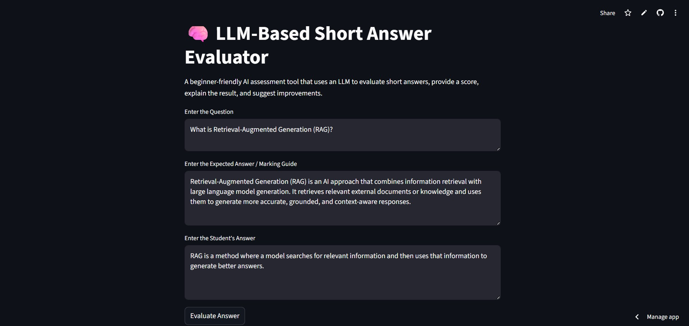
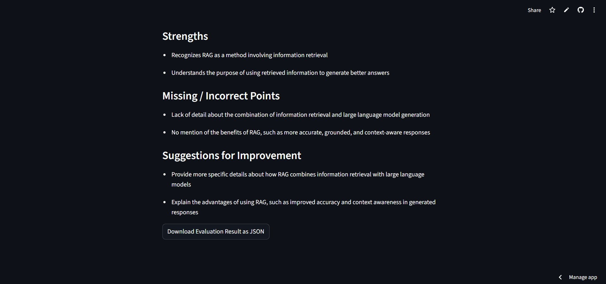

# 🧠 LLM-Based Short Answer Evaluator

A beginner-friendly AI-powered assessment tool built using **Python, Streamlit, and Groq API**.

This application evaluates a student's answer using a Large Language Model (LLM) and provides structured feedback.

🚀 **Live Demo:** 

👉 https://llm-based-short-answer-evaluator-8wfqpnsjzkbgsgobkabut3.streamlit.app/

## 📸 Demo

### 🖥️ App Interface


### 📊 Evaluation Result



---

## 🚀 Features

- Score answers out of 10
- Add grading levels (Excellent, Good, Fair, Poor)
- Explain reasoning behind the score
- Identify strengths
- Highlight missing or incorrect points
- Suggest improvements
- Download evaluation as JSON

---

## 🛠️ Tech Stack

- Python
- Streamlit
- Groq API (LLM)
- Prompt Engineering

---

## ▶️ Run Locally

```bash
pip install -r requirements.txt
streamlit run app.py
```

---

## 🔐 Environment Setup

Create a `.env` file:

```env
GROQ_API_KEY=your_api_key_here
```

---

## 🎯 Learning Outcomes

- Understanding of Large Language Models (LLMs)
- Prompt engineering basics
- Building AI-powered applications
- Structured output generation

---

## 📌 Future Improvements

- Support multiple questions (quiz mode)
- Integrate Retrieval-Augmented Generation (RAG)
- Improve UI/UX with better visualization

---

## 👩‍💻 Author

**Janeesha Dewmini** 

---
